# IP封装

<!-- @import "[TOC]" {cmd="toc" depthFrom=1 depthTo=6 orderedList=false} -->

<!-- code_chunk_output -->

- [更新日志](#更新日志)
- [参考资料连接](#参考资料连接)
- [1.生成网表](#1生成网表)
- [2.封装IP](#2封装ip)
  - [2.1 直接调用](#21-直接调用)
  - [2.2 封装IP](#22-封装ip)
- [2.3 调用IP](#23-调用ip)

<!-- /code_chunk_output -->

## 更新日志

- Zheng
  - v0.1 2025/3/26
    - 初版，仅供内部使用，未完成验证

## 参考资料连接

  - [Vivado生成网表文件并创建自定义IP](https://blog.csdn.net/hy_520520/article/details/140610668)

  - [VIVADO 自定义封装ip核（超详细）](https://blog.csdn.net/qq_44517329/article/details/127758601)

  - [使用Vivado将包含Xilinx IP的用户模块封装成网表文件（也适用不包含Xilinx IP的用户模块）](https://zhuanlan.zhihu.com/p/392521600)

## 1.生成网表

  - 在``Tools -> Settings -> Synthesis``选项中改变参数``flatten_hierarchy``为``full``，并在``More Options``中添加``-mode out_of_context``，并应用。在生成网表后记得改回。

  <!-- <div align="center">
    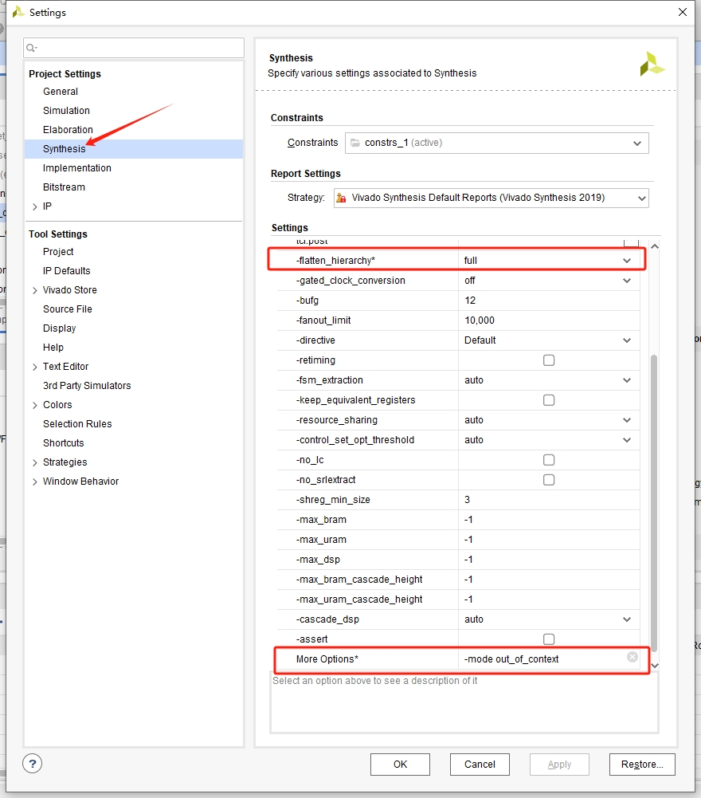
    <p style="text-align: center; font-size: smaller; margin-top: -10px; font-style:italic;">图1.1 生成网表示例</p>
  </div> -->

  

  - 将需要封装的设计设为顶层，重新综合布线后``Open Implemented Design``，并执行指令：

    - 写网表EDF文件，文件名与原设计相同，==注意文件路径的斜杠为 / 不是 \\，下同==。

    ```tcl
      //模块不包含Xilinx的IP
      write_edif <design_name>.edf 

      //模块包含Xilinx的IP
      write_edif -security_mode all <design_name>.edf 
    ```

    - 写综合布线后的verilog文件，文件名与原设计相同

    ```tcl
      //不指定类型的通用写法，输出文件可用于仿真与综合布线
      write_verilog <design_name>.v 
    ```

    <!-- <div align="center">
      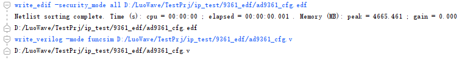
      <p style="text-align: center; font-size: smaller; margin-top: -10px; font-style:italic;">图1.2 生成网表示例</p>
      <p style="text-align: center; font-size: smaller; margin-top: -10px; font-style:italic;">（仅供格式参考，图中不代表最终指令）</p>
    </div> -->

    

## 2.封装IP

### 2.1 直接调用

  - 若是较为简单的工程或无包装为ip的需求，直接调用导出的verilog与edf文件即可，成功后的UI显示如下：

  <!-- <div align="center">
    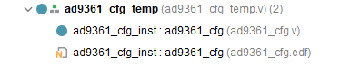
    <p style="text-align: center; font-size: smaller; margin-top: -10px;font-style:italic;">图2.1 网表调用示例</p>
  </div> -->

  

### 2.2 封装IP

  - 新建工程，导入刚刚生成的verilog与edf文件，将edf网表文件设置为顶层后，顺序打开UI界面选项``Tools -> Create and Package New IP ...``，并按照提示设置IP临时工程。

  <!-- <div align="center">
    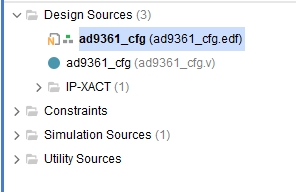
    <p style="text-align: center; font-size: smaller; margin-top: -10px; font-style:italic;">图2.2 设置顶层</p>
  </div>

  <div align="center">
    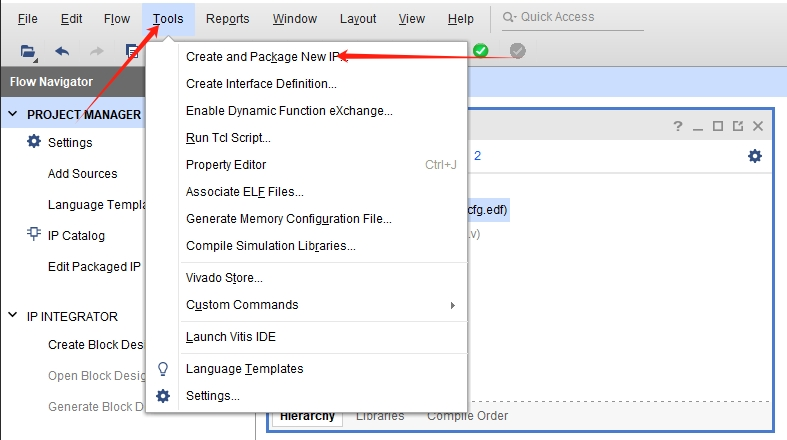
    <p style="text-align: center; font-size: smaller; margin-top: -10px; font-style:italic;">图2.3 临时工程设置1</p>
  </div>

  <div align="center">
    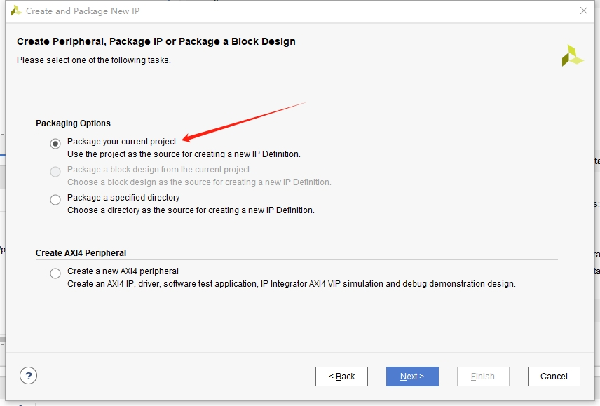
    <p style="text-align: center; font-size: smaller; margin-top: -10px; font-style:italic;">图2.4 临时工程设置2</p>
  </div>

  <div align="center">
    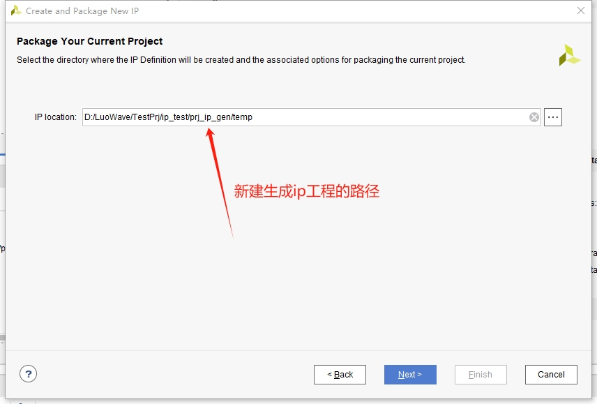
    <p style="text-align: center; font-size: smaller; margin-top: -10px; font-style:italic;">图2.5 临时工程设置3</p>
  </div> -->

  

  

  

  

  - 将以上的引导步骤设置完毕并点击最后的Finish后，会弹出一个用于生成并封装IP的临时工程，在``Package IP``窗口中设置IP的具体内容。

  <!-- <div align="center">
    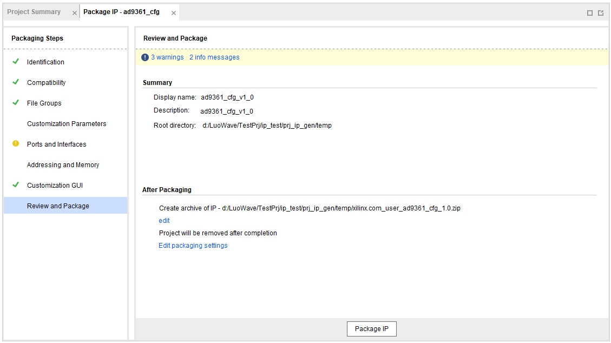
    <p style="text-align: center; font-size: smaller; margin-top: -10px; font-style:italic;">图2.6 IP选项卡</p>
  </div> -->

  

  - ``Identification``：填写公司及设计人相关信息。

  - ``Compatibility``：设置IP适配的FPGA型号、仿真适配、以及Vitis相关内容。

  - ``File Groups``：设置IP包含的文件，可添加仿真文件、产品说明等。

  - ``Port and Interfaces``：设置IP核的对外接口属性。

  - ``Addressing and Memory``：设置储存大小以及地址（若有）。

  - ``Customization GUI``：设置IP的UI界面以及对用户开放的参数属性等。

  - ``Revie and Package``：IP包装界面，在此界面需要点击``Edit packaging Settings``，并在打开的选项中勾选``Create achive of IP``以将IP归档生成，并应用。最后点击最下方的``Package IP``选项完成封装。

  <!-- <div align="center">
    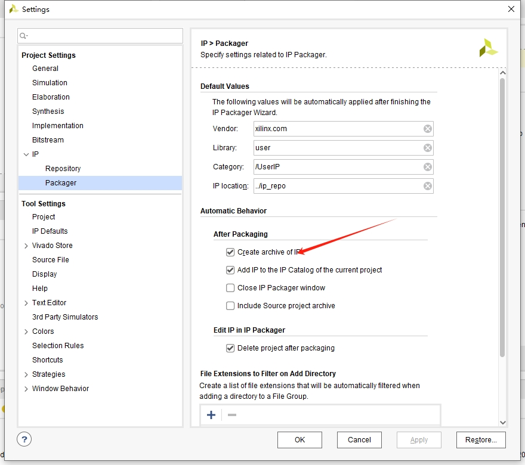
    <p style="text-align: center; font-size: smaller; margin-top: -10px; font-style:italic;">图2.7 设置IP归档</p>
  </div> -->

  

## 2.3 调用IP

  - 在前面的临时IP工程下存在封装好的IP压缩包，将其拷贝至用户自定义的IP目录并解压，并在``Tools -> Settings -> IP -> Repository``中添加用户IP目录即可。

  <!-- <div align="center">
    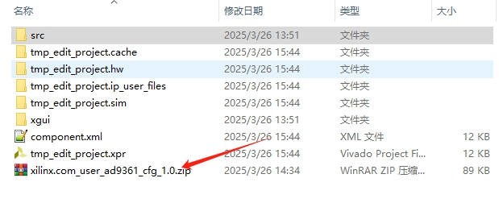
    <p style="text-align: center; font-size: smaller; margin-top: -10px; font-style:italic;">图2.8 IP文件</p>
  </div>

  <div align="center">
    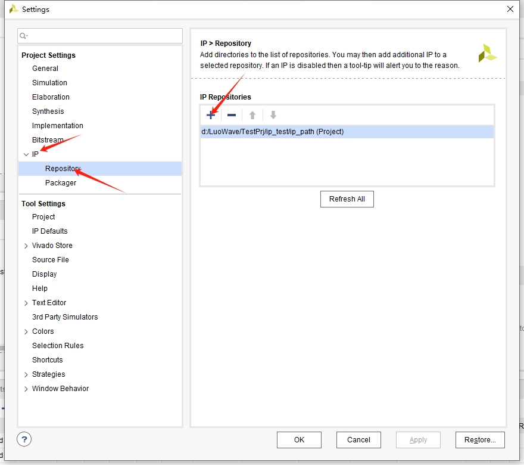
    <p style="text-align: center; font-size: smaller; margin-top: -10px; font-style:italic;">图2.9 添加路径</p>
  </div> -->

  

  
