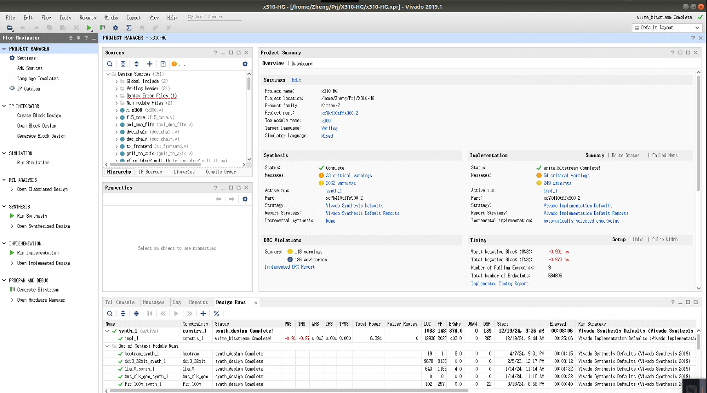

# UHD4.0 RFNoC 调试记录

<!-- @import "[TOC]" {cmd="toc" depthFrom=2 depthTo=3 orderedList=false} -->

<!-- code_chunk_output -->

- [更新日志](#更新日志)
- [1 环境依赖](#1-环境依赖)
  - [1.1 Python3](#11-python3)
  - [1.2 Vivado 2019.1](#12-vivado-20191)
  - [1.3 安装指定软件](#13-安装指定软件)
- [2 创建OOT(out-of-tree)模组](#2-创建ootout-of-tree模组)
- [3 FPGA框架(无IP)](#3-fpga框架无ip)
  - [3.1 rfnoc_block_gain.v](#31-rfnoc_block_gainv)
  - [3.2 noc_shell_gain.v](#32-noc_shell_gainv)
  - [3.3 rfnoc_block_gain_tb.sv](#33-rfnoc_block_gain_tbsv)
  - [3.4 Makefile.srcs](#34-makefilesrcs)
  - [3.5 gain_x310_rfnoc_image_core.yml](#35-gain_x310_rfnoc_image_coreyml)
  - [3.6 编译](#36-编译)
  - [3.7 仿真](#37-仿真)
  - [3.8 bit流](#38-bit流)
- [4 FPGA框架(有IP)](#4-fpga框架有ip)
  - [4.1 仿真](#41-仿真)
  - [4.2 bit流 (方案1)](#42-bit流-方案1)
  - [4.3 bit流 (方案2)](#43-bit流-方案2)
- [5 UHD框架 (C++)](#5-uhd框架-c)
- [6 GNU Radio框架](#6-gnu-radio框架)
- [7 编译与烧录](#7-编译与烧录)
- [8 测试](#8-测试)

<!-- /code_chunk_output -->

## 更新日志

**版本**

- Zheng

  - v0.1 2024/12/19

    - 初版

## 1 环境依赖

### 1.1 Python3

  ```bash
  sudo apt install git cmake g++ libboost-all-dev libgmp-dev swig \
  python3-numpy python3-mako python3-sphinx python3-lxml \
  doxygen libfftw3-dev libsdl1.2-dev libgsl-dev libqwt-qt5-dev \
  libqt5opengl5-dev python3-pyqt5 liblog4cpp5-dev libzmq3-dev \
  python3-yaml python3-click python3-click-plugins python3-zmq \
  python3-scipy python3-gi python3-gi-cairo gobject-introspection \
  gir1.2-gtk-3.0 build-essential libusb-1.0-0-dev python3-docutils \
  python3-setuptools python3-ruamel.yaml python-is-python3

  export PYTHONPATH=/usr/local/lib/python3/dist-packages
  ```

### 1.2 Vivado 2019.1

- 建议安装至系统默认的` /opt/Xilinx/ ` 路径下，之后步骤可省去路径指定。

- 安装缺少的库

  ```bash
    sudo apt install libtinfo5 libncurses5
  ```

- HLS IP兼容补丁

  下载官方补丁[Export IP Invalid Argument / Revision Number Overflow Issue (Y2K22)](https://adaptivesupport.amd.com/s/article/76960?language=en_US)，并解压。

  ```bash
    cd /opt/Xilinx/
    python3 <patch_dir>/y2k22_patch/patch.py
  ```

  出现以下类似提示便为成功

  ```plain
    [2025-02-11] INFO: This script (version: 1.2) patches Xilinx Tools for HLS Y2k22 bug for the following release: 
		    2014.*, 2015.*, 2016.*, 2017.*, 2018.*, 2019.*, 2020.* and 2021.*
    [2025-02-11] UPDATE: /opt/Xilinx/Vivado/2019.1/common/scripts
    [2025-02-11] IGNORED: /opt/Xilinx/y2k22_patch/automg_patch_20220104.tcl does not exists
    [2025-02-11] COPY: /opt/Xilinx/y2k22_patch/automg_patch_20220104.tcl  to /opt/Xilinx/Vivado/2019.1/common/scripts/automg_patch_20220104.tcl
  ```

### 1.3 安装指定软件

  创建安装软件的环境文件夹` <uhd_dir> `，并在其下编译源码安装，且编译安装完成后==不要==删除源码。不建议使用apt-get直接安装软件。

- UHD 4.0

    本方案只测试过UHD4.0，在UHD4+的版本中方法类似，只存在 *_impl.cc、*.v等自动生成文件细小差别，可自行选择所需的UHD版本。

    ```bash
      cd /<uhd_dir>
      git clone --branch UHD-4.0 https://github.com/ettusresearch/uhd.git uhd
      cd uhd/host/
      mkdir build && cd build
      cmake ../
      make -j8
      sudo make install
    ```

- gnuradio 3.8

    gnuradio与UHD需版本匹配，否则大概率无法工作。

    ```bash
      cd /<uhd_dir>
      git clone --branch maint-3.8 --recursive https://github.com/gnuradio/gnuradio.git gnuradio
      cd gnuradio/
      mkdir build && cd build
      cmake ../
      make -j8
      sudo make install
    ```

- gr-ettus

    ```bash
      cd /<uhd_dir>
      git clone --branch maint-3.8-uhd4.0 https://github.com/ettusresearch/gr-ettus.git gr-ettus
      cd gr-ettus/
      mkdir build && cd build
      cmake -DENABLE_QT=True ../
      make -j8
      sudo make install
    ```

## 2 创建OOT(out-of-tree)模组

  创建工作所需工作空间` <work_dir> `，并键入以下指令：

  ```bash
    cd /<work_dir>
    rfnocmodtool newmod <OOT_name>
    cd rfnoc-<OOT_name> 
    rfnocmodtool add <block_name>
  ```

  其中` <OOT_name> `为整个模组名字，类似于类名；` <block_name> `为块名，类似于方法名。
  在以下的示例中` <OOT_name> `使用tutorial，` <block_name> `使用==gain==（无IP核心）与==mult==（有IP核）演示。
  
  键入指令后出现如下选项：

  ```plain
    RFNoC module name identified: tutorial
    Block/code identifier: gain
    Enter valid argument list, including default arguments: 
    Add Python QA code? [y/N] n
    Add C++ QA code? [y/N] n
    Block NoC ID (Hexadecimal): 
      # 可自定义模块id，直接回车则是随机id号
    Random NoC ID generated: A91FC792
    Skip Block Controllers Generation? [UHD block ctrl files] [y/N] n
    Skip Block interface files Generation? [GRC block ctrl files] [y/N] n
  ```
  
  具体工作情况如下：
  

  其文件树仅供参考，见[File Tree](./example/file_tree_OOT_gen.txt)

## 3 FPGA框架(无IP)

### 3.1 rfnoc_block_gain.v

  其在路径`/rfnoc-tutorial/rfnoc/fpga/rfnoc_block_gain/`下，需修改其寄存器相关代码，并添加用户逻辑RTL代码。

  寄存器代码如下，需修改其寄存器地址与初始值：

  

  用户逻辑代码如下，添加相关逻辑，其中相关时序需严格处理：

  

### 3.2 noc_shell_gain.v

  其在路径`/rfnoc-tutorial/rfnoc/fpga/rfnoc_block_gain/`下，若需要的模块与RFNoC框架间存在输入输出数据交互，则无需更改；
  
  若仅存在输出，不存在输入交互，则需修改，并严格遵守握手时序，参考代码见官方的==rfnoc_block_siggen==相关代码，相关文件位于`<uhd_dir>/UHD-4.0/uhd/fpga/usrp3/lib/rfnoc/blocks/rfnoc_block_siggen/`

### 3.3 rfnoc_block_gain_tb.sv

  其在路径`/rfnoc-tutorial/rfnoc/fpga/rfnoc_block_gain/`下，需修改其寄存器读写测试以及输入输出测试代码。

  寄存器读写测试代码如下，替换成RTL逻辑代码中设置的寄存器名及其地址：
  

  输入输出测试代码如下，修改sample_in与sample_out以达到输入输出验证的效果，send_samples[i]与recv_samples[i]分别为dut模块的用户代码块输入输出载荷。
  

### 3.4 Makefile.srcs

  其在路径`/rfnoc-tutorial/rfnoc/fpga/rfnoc_block_gain/`下，添加编译所需的.v .sv .vh文件，例如：

  ```makefile
    RFNOC_OOT_SRCS += $(addprefix $(dir $(abspath $(lastword $(MAKEFILE_LIST)))), rfnoc_gain_core.v rfnoc_block_gain_regs.vh)
  ```

### 3.5 gain_x310_rfnoc_image_core.yml

  其在路径` /rfnoc-tutorial/rfnoc/icores/ `下，后续工具会根据此描述文件生成RFNoC框架，默认生成的框架中用户模块被直接连接在一个Endpoint上，没有与ddc、duc等模块级联。也就是说在gnuradio的流图中无需与其他模块绑定使用，但也可以在流图中与yml描述存在的模块级联。以下部分流图仅供参考：

  

  

  **若要添加多个用户逻辑代码块还需自行设计框架结构**。

  在此文件中亦指定了生成的**目标设备型号**与FPGA最终实现的**硬件指标**等，具体args请在官网的具体设备下查找。

  

### 3.6 编译

  键入以下指令：

  ```bash
    cd /<work_dir>/rfnoc-tutorial/
    mkdir build && cd build
    cmake -DUHD_FPGA_DIR=/<uhd_dir>/UHD-4.0/uhd/fpga/ ../
  ```

  成功后有如下提示

  ```plain
    -- Configuring done
    -- Generating done
    -- Build files have been written to: 
  ```

  此时有许多可选功能实现，键入以下指令查看：

  ```bash
    make help
  ```

  ```plain
    The following are some of the valid targets for this Makefile:
    ... all (the default if no target is provided)
    ... clean
    ... depend
    ... install/strip
    ... install
    ... uninstall
    ... testbenches
    ... rebuild_cache
    ... install/local
    ... test
    ... list_install_components
    ... edit_cache
    ... gnuradio-tutorial
    ... pygen_apps_9a6dd
    ... doxygen_target
    ... tutorial_swig_swig_doc
    ... _tutorial_swig_doc_tag
    ... tutorial_swig
    ... tutorial_swig_swig_compilation
    ... pygen_swig_5cf62
    ... pygen_python_d20bf
    ... rfnoc_block_gain_tb
    ... gain_x310_rfnoc_image_core
  ```

### 3.7 仿真

  此步骤可选择不执行验证，但即使对自己的核心逻辑代码做过验证，也无法保证其可在RFNoC框架下契合时序。==强烈建议在生成bit流前执行此仿真步骤==。

  在build文件夹下键入以下指令便可查看RTL逻辑代码在RFNoC框架下的仿真是否通过：
  
  ```bash
    make rfnoc_block_gain_tb
  ```

  如出现以下log信息且在此log下无error，则表示仿真通过。请注意有些时序错误显示pass但紧跟着下面打印ERROR，例如CHDR不匹配等信息。

  ```plain
    ========================================================
    TESTBENCH STARTED: rfnoc_block_gain_tb
    ========================================================
    [TEST CASE   1] (t =         0 ns) BEGIN: Flush block then reset it...
    [TEST CASE   1] (t =      6400 ns) DONE... Passed
    [TEST CASE   2] (t =      6400 ns) BEGIN: Verify Block Info...
    [TEST CASE   2] (t =      6400 ns) DONE... Passed
    [TEST CASE   3] (t =      6400 ns) BEGIN: Verify user register...
    [TEST CASE   3] (t =      7825 ns) DONE... Passed
    [TEST CASE   4] (t =      7825 ns) BEGIN: Test passing through samples...
    [TEST CASE   4] (t =      8395 ns) DONE... Passed
    ========================================================
    TESTBENCH FINISHED: rfnoc_block_gain_tb
    - Time elapsed:  8395 ns
    - Tests Run:     4
    - Tests Passed:  4
    - Tests Failed:  0
    Result: PASSED   
    ========================================================
  ```

### 3.8 bit流

  在build文件夹下键入以下指令便可编译制作bit流：

  ```bash
    make gain_x310_rfnoc_image_core
  ```

  此步骤耗时很久，根据目标设备在10min到2h不等（8核电脑环境下），最后生成的bit文件在路径：

  ```bash
    # 具体路径以使用的设备为准，此例使用设备为X310
    <uhd_dir>/UHD-4.0/uhd/fpga/usrp3/top/x300/build/
  ```

## 4 FPGA框架(有IP)

### 4.1 仿真

  关于RTL代码及相关处理，前面可按**3.1**~**3.6**处理，存在ip的情况与无ip在**3.7**开始有些区别。

  打开` /<work_dir>/rfnoc-tutorial/rfnoc/fpga/rfnoc_block_gain/Makefile.srcs `，并添加仿真相关的ip核心xci文件。

  ```makefile
    RFNOC_OOT_SRCS += $(addprefix $(dir $(abspath $(lastword $(MAKEFILE_LIST)))), /ip/my_gain.xci )
  ```

  然后再仿真测试

  ```bash
    make rfnoc_block_gain_tb
  ```

### 4.2 bit流 (方案1)

  注释上面仿真步骤中在`Makefile.srcs`中添加的xci文件，不然后续生成bit流时会冲突。

  ```makefile
    # RFNOC_OOT_SRCS += $(addprefix $(dir $(abspath $(lastword $(MAKEFILE_LIST)))), /ip/my_gain.xci )
  ```

  将所需的ip添加至源码库中编译：

  ```bash
    # 不同设备的编译库不同
    cd /<uhd_dir>/UHD-4.0/uhd/fpga/usrp3/lib/ip/
    mkdir my_gain && cd my_gain
    cp <ip_dir>/my_gain.xci my_gain.xci
    gedit Makefile.inc
  ```

  ```makefile
    # Makefile.inc中添加以下代码
    include $(TOOLS_DIR)/make/viv_ip_builder.mak

    LIB_IP_MY_GAIN_SRCS = $(IP_BUILD_DIR)/my_gain/my_gain.xci

    LIB_IP_MY_GAIN_OUTS = $(addprefix $(IP_BUILD_DIR)/my_gain/, \
      my_gain.xci.out \
      synth/my_gain.vhd \
    ) 

    $(LIB_IP_MY_GAIN_SRCS) $(LIB_IP_MY_GAIN_OUTS) : $(LIB_IP_DIR)/my_gain/my_gain.xci
     $(call BUILD_VIVADO_IP,my_gain,$(ARCH),$(PART_ID),$(LIB_IP_DIR),$(IP_BUILD_DIR),0)

    # 保存后离开
  ```

  ```bash
    gedit ../Makefile.inc
  ```

  ```makefile
    # 在其中的.PHONY: lib_ip前添加
    include $(LIB_IP_DIR)/my_gain/Makefile.inc
    LIB_IP_XCI_SRCS += $(LIB_IP_MY_GAIN_SRCS)
    LIB_IP_SYNTH_OUTPUTS += $(LIB_IP_MY_GAIN_OUTS)

    # 保存后离开
  ```

  ```bash
    cd /<work_dir>/rfnoc-tutorial/build/
    make gain_x310_rfnoc_image_core
  ```

  目标文件路径同**3.8**中一样。

### 4.3 bit流 (方案2)

  此方案需要源码编译生成的Vivado图形化工程(.xpr)，并在Vivado的UI界面中编译。

  ```bash
    cd /<work_dir>/rfnoc-tutorial/
    gedit CMakeLists.txt
  ```

  ```makefile
    // 检索字符串_rfnoc_image_builder_exe，找到以下指令
    add_custom_target(${_target_name}
        COMMAND ${_rfnoc_image_builder_exe} -F ${UHD_FPGA_DIR} -y ${CMAKE_CURRENT_SOURCE_DIR}/${_rfnoc_image_core_SRC} -I ${CMAKE_SOURCE_DIR}/rfnoc
    )
  ```

  ```makefile
    // 将上面代码段的add_custom_target后面添加指令，让其只生成编译需要替换的hex与image core而不生成bit流
    add_custom_target(${_target_name}
        COMMAND ${_rfnoc_image_builder_exe} -F ${UHD_FPGA_DIR} -y ${CMAKE_CURRENT_SOURCE_DIR}/${_rfnoc_image_core_SRC} -I ${CMAKE_SOURCE_DIR}/rfnoc --generate-only
    )
  ```

  ```bash
    cd build
    make gain_x310_rfnoc_image_core
  ```

  打开Vivado的UI界面，并打开源工程

  

  打开选项界面` Tools -> Settings -> general -> Verilog options `，并修改参数` RFNOC_EDGE_TBL_FILE `与参数` UHD_FPGA_DIR `。

- RFNOC_EDGE_TBL_FILE: 改为` /<work_dir>/rfnoc-tutorial/icores/x310_static_router.hex `

- UHD_FPGA_DIR: 改为` /<uhd_dir>/UHD-4.0/uhd/fpga/usrp3/../.. `

  

  

  然后将刚刚在` <work_dir> `中生成的image core替换到该工程的image core。
  
  若为标准x310工程，image core为
  ` /x310-HG.srcs/sources_1/imports/usrp3/top/x300/x310_rfnoc_image_core.v `

  在UI界面中检查是否为刚生成的image core内容

  

  确认无误后便可在UI界面中完成` Synthesis -> Implementation -> Bitstream `的流程。在这里可以用图形化界面添加调用IP核，更为直观方便。

## 5 UHD框架 (C++)

  根据用户需求，主要改写寄存器映射。需要改写
  
  ` /<work_dir>/rfnoc-tutorial/lib/gain_block_ctrl_impl.cpp `
  
  ` /<work_dir>/rfnoc-tutorial/include/tutorial/gain_block_ctrl.hpp `
  
  下面给出简单改写后的文件，仅供参考：

  [gain_block_ctrl_impl.cpp](./example/gain_block_ctrl_impl.cpp)

  [gain_block_ctrl.hpp](./example/gain_block_ctrl.hpp)

## 6 GNU Radio框架

  根据用户需求，主要改写gnuradio图形化界面模块的对用户接口，以及UHD映射。需要改写
  
  ` /<work_dir>/rfnoc-tutorial/grc/tutorial_gain.block.yml `

  下面给出简单改写后的文件，仅供参考：

  [tutorial_gain.block.yml](./example/tutorial_gain.block.yml)

## 7 编译与烧录

  在处理完上面的` FPGA -> UHD -> GNU Radio `的关系后还需整体编译，并添加至环境中。

  ```bash
    cd /<work_dir>/rfnoc-tutorial/build/
    make gnuradio-tutorial
    make -j8
    sudo make install
  ```

  将之前生成的bit流烧录至目标设备中。
  
  ==此步骤需谨慎进行，若对FPGA源代码改动较大容易变砖，建议在Vivado的UI界面用jtag调试通过后再烧写。若变砖了也可在重新上电后，通过jtag调试原版bit流，再使用uhd_image_loader烧写。==

  ```bash
    uhd_image_loader --args "type=x300,addr=192.168.10.2" --fpga-path /<uhd_dir>/UHD-4.0/uhd/fpga/usrp3/top/x300/build/usrp_x310_fpga_HG.bit
  ```

## 8 测试

  打开GNU Radio

  ```bash
    sudo gnuradio-companion
  ```

  图形化界面中打开文件` /<work_dir>/rfnoc-tutorial/example/gain.grc `

  

  点击运行，若弹出理想波形则成功。

  有时gnuradio会报错找不到*.py的包，此时需手动搬移：

  ```bash
    cp -r /usr/local/lib/python3/dist-packages/<缺少的包名> /usr/lib/python3/dist-packages/
  ```
